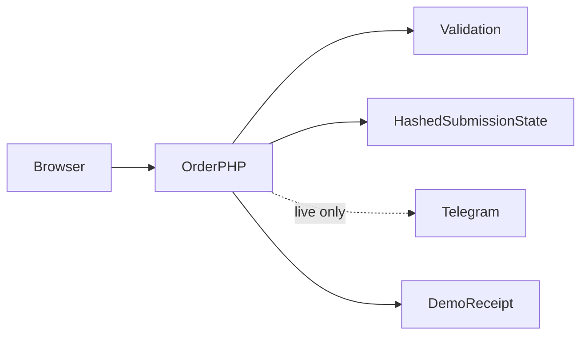
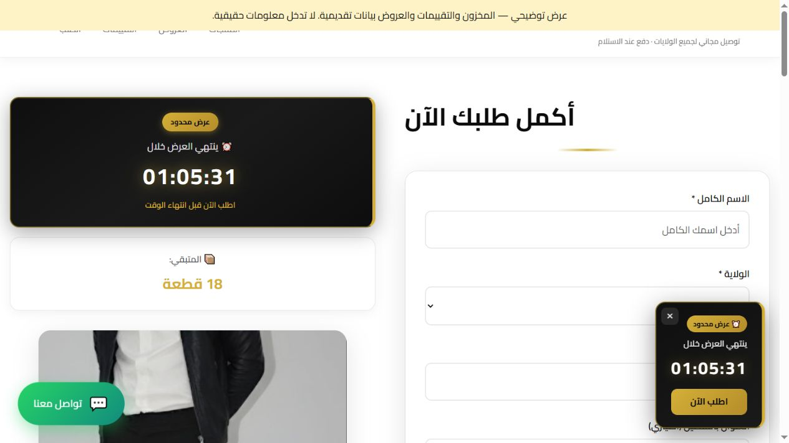

# Flashdrop

**صفحة بيع جزائرية بالدفع عند الاستلام**

[English](README.md)

تحويل زيارة المنتج عبر الهاتف إلى طلب توصيل محلي صحيح دون كشف بيانات المزود.

**التقنيات:** HTML · CSS · JavaScript · PHP · Telegram

## الحالة والتاريخ

صفحة بيع جزائرية مركزة مع إجراءات طلب. المخزون والتقييمات والعروض في العرض بيانات تقديمية.

هذه نسخة عرض منقحة للنشر. تعرض [وثيقة التحقق](docs/verification.ar.md) الفحوص الحالية بصورة مستقلة عن النشر السابق.

## الوظائف والإجراءات

- صور منتج وتخطيط بيع متجاوب
- فحص هاتف جزائري وحقول الولاية والبلدية
- توصيل منزلي أو مكتب ولون ومقاس وإجمالي الكمية
- استعادة النموذج وحالات التحميل والمحاولة
- إرسال Telegram من الخادم ووضع عرض دون مزود

اختيار النوع والتوصيل ← فحص الحقول ← إرسال PHP مع مفتاح منع التكرار ← تحقق الخادم ← قبول العرض أو تأكيد Telegram ← عرض رقم الطلب من الخادم.

## البنية

## القرارات الهندسية

- نقل توكن البوت من المتصفح يغير حدود الثقة: يرسل المتصفح الطلب ويحتفظ الخادم ببيانات المزود.
- قوائم القيم المسموحة مأخوذة من خيارات الواجهة. يمكن تجاوز فحص المتصفح وحده.
- يمنع سجل طلب مقفل ومحمي بالتجزئة إعادة إرسال الطلب الناجح. تحتاج نتيجة المزود غير المؤكدة إلى مراجعة.
- يحفظ سجل النجاح المحلي أرقام الإيصالات والأوقات فقط. مسودة النموذج محلية ويجب حذفها على الأجهزة المشتركة.

## المجلدات

| المكون | المسؤولية |
|---|---|
| `index.html` | صفحة المنتج ونموذج الطلب |
| `api/order.php` | الفحص ومنع التكرار وحدود المزود |
| `api/options.json` | خيارات الطلب المسموح بها |
| `1.jpg … 5.jpg` | صور المنتج الموجودة |

## التثبيت والإعداد

استخدم PHP 8.1 أو أحدث مع cURL للإرسال الفعلي. وضع العرض افتراضي: `php -S 127.0.0.1:8084`. يقرأ PHP متغيرات البيئة المصدرة ولا يقرأ `.env` تلقائياً. للإرسال اضبط `DEMO_MODE=0` والتوكن ومعرف المحادثة ومجلد حالة خارج الجذر العام.

توجد أوامر التشغيل ومتغيرات البيئة في [دليل الإعداد](docs/setup.ar.md). القيم أمثلة محلية أو حقول فارغة؛ لا تعِد استخدام بيانات إنتاج سابقة.

## العرض والتحقق

اختيار النوع والتوصيل ← فحص الحقول ← إرسال PHP مع مفتاح منع التكرار ← تحقق الخادم ← قبول العرض أو تأكيد Telegram ← عرض رقم الطلب من الخادم.

استخدم حسابات وسجلات اصطناعية. راجع [خطوات العرض](docs/demo.ar.md) وسجل نتائج الفحوص الحالية. نجاح بناء مكون لا يثبت نجاح كل مسارات المنتج.

## الحدود

يُفحص طول البلدية دون قائمة إدارية شاملة. يحتاج الإرسال الحي غير المؤكد مراجعة المشغل ولا يُعاد بمفتاح جديد عشوائياً. العروض والمخزون والمراجعات محتوى تقديمي.

## التوثيق

- [البنية](docs/architecture.ar.md)
- [الإعداد](docs/setup.ar.md)
- [العرض](docs/demo.ar.md)
- [المسارات](docs/api.ar.md)
- [الفحوص الحالية](docs/verification.ar.md)
- [النشر وحل المشكلات](docs/deployment.ar.md)
- [حقوق الأصول](THIRD_PARTY_NOTICES.md)

## المساهمة والترخيص

افتح مشكلة تتضمن خطوات إعادة الإنتاج والمكون المعني. استخدم بيانات اصطناعية وتعديلات مركزة وفحوصاً مناسبة، ولا ترسل أسراراً أو سجلات مستخدمين خاصة. الشيفرة بترخيص [MIT](LICENSE)، وتحتفظ الاعتماديات والأصول الخارجية بشروطها الأصلية.

<!-- release-presentation -->

## من التطبيق الفعلي

هذه لقطة فعلية للواجهة المحلية، وليست دليلاً على استخدام إنتاجي أو فحص أندرويد.

## التحقق والقراءة المتعمقة

نجحت صياغة PHP وفحوص إيصال تجريبي صحيح وإرجاع الإيصال نفسه للمفتاح المتكرر ورفض تغيير الحمولة وفحص الهاتف والكمية والخيارات ورفض مصدر خارجي. لا تتضمن أصول المتصفح رمز بوت Telegram. لم يُثبت الإرسال الحي.

يُفحص طول البلدية دون قائمة إدارية شاملة. يحتاج الإرسال الحي غير المؤكد مراجعة المشغل ولا يُعاد بمفتاح جديد عشوائياً. العروض والمخزون والمراجعات محتوى تقديمي.

- [دراسة المشروع](docs/case-study.ar.md)
- [التحقق](docs/verification.ar.md)
- [مخطط البنية](docs/architecture.svg)
- [صفحة المشروع](https://mohamedabderrehmane.netlify.app/ar/projects/flashdrop-cod/)

- [تفاصيل هندسية ودروس التنفيذ](docs/engineering-notes.ar.md)
