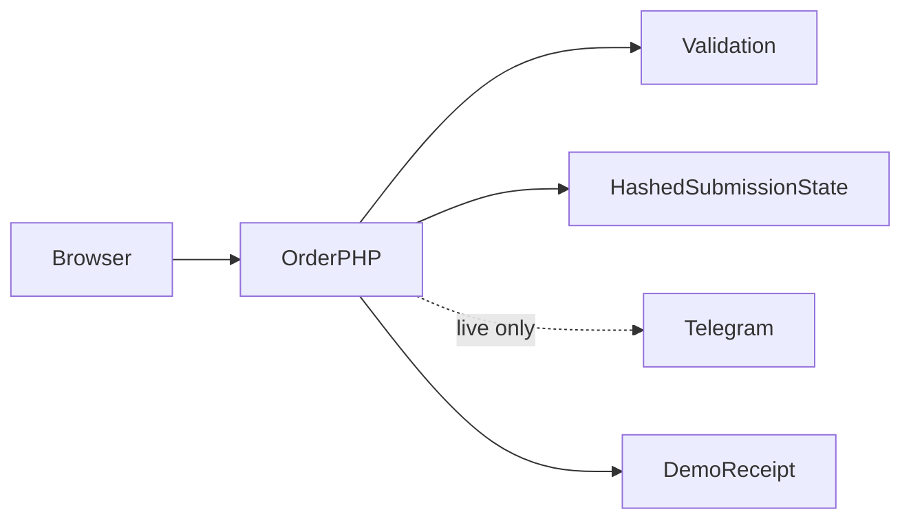

# Flashdrop

**An Algerian cash-on-delivery landing page**

[العربية](README.ar.md)

Turn a mobile product visit into a validated local delivery request without exposing provider credentials.

**Technology:** HTML · CSS · JavaScript · PHP · Telegram

## Status and deployment history

Focused Algerian COD landing page with an order workflow; stock, reviews and offers in the portfolio demo are presentation content.

This is a sanitized portfolio release. See the current [verification record](docs/verification.md) before choosing a runtime demonstration.

## Main workflows and implemented features

- Responsive product imagery and conversion layout
- Algerian phone validation and wilaya/municipality fields
- Home/office delivery, colour, size and quantity totals
- Form recovery, loading states and retry handling
- Server-side Telegram order delivery and explicit offline demo mode

Choose variant and delivery → validate customer fields → submit to PHP with an idempotency key → server validates again → demo accepts or Telegram confirms → interface displays the server order number.

## Architecture

## Engineering decisions

- Moving the bot token out of browser code changes the trust boundary: the browser sends an order, while the server owns provider credentials.
- Server allowlists are derived from the actual variant and delivery controls. Browser validation alone is bypassable.
- A locked hashed submission record avoids resending a successful request. An uncertain provider outcome is held for reconciliation rather than silently retried.
- Successful local backups contain only receipt IDs and timestamps. Draft form recovery remains local and should be cleared on shared devices.

## Directory guide

| Component | Responsibility |
|---|---|
| `index.html` | Landing page and order interface |
| `api/order.php` | Validation, idempotency and provider boundary |
| `api/options.json` | Allowed existing order options |
| `1.jpg … 5.jpg` | Existing product imagery |

## Installation

Use PHP 8.1+ with cURL for live delivery. Demo mode is the default: run `php -S 127.0.0.1:8084`. PHP reads exported environment variables, not `.env` automatically. For live operation set `DEMO_MODE=0`, `TELEGRAM_BOT_TOKEN`, `TELEGRAM_CHAT_ID` and an `ORDER_STATE_DIR` outside the web root. Preserve TLS validation and store secrets through the hosting environment.

All required/private configuration is described in [setup](docs/setup.md). Examples contain placeholders or local demo values. Never reuse historical credentials.

## Demonstration

- Submit synthetic Algerian phone/name and a valid variant.
- Change quantity and delivery option; inspect totals.
- Submit invalid fields directly to PHP; expect rejection.
- Repeat the same idempotency key; verify the same receipt. Use a changed payload with that key; expect conflict.

## Verification and limitations

- No Telegram token in browser assets
- PHP validation and demo success
- Invalid phone/options/quantity rejection
- Idempotency repeat and conflict; provider failure must not show success

Municipality names are validated for length, not against a complete administrative dataset. No payment processing. Live Telegram delivery requires a separate provider check; uncertain sends require operator reconciliation.

## Documentation

- [Architecture](docs/architecture.md) · [العربية](docs/architecture.ar.md)
- [Setup and configuration](docs/setup.md) · [العربية](docs/setup.ar.md)
- [Demo walkthrough](docs/demo.md) · [العربية](docs/demo.ar.md)
- [API and execution paths](docs/api.md)
- [Verification record](docs/verification.md)
- [Deployment and troubleshooting](docs/deployment.md)
- [Asset attribution](THIRD_PARTY_NOTICES.md) · [MIT license](LICENSE)

## Contributing

Open an issue describing a reproducible problem, expected behavior and component involved. Use synthetic data. Keep changes focused and include relevant checks. Do not include credentials or private user records.

## License and attribution

Source code is MIT licensed. Third-party dependencies and assets retain their own terms; see [attribution](THIRD_PARTY_NOTICES.md).
