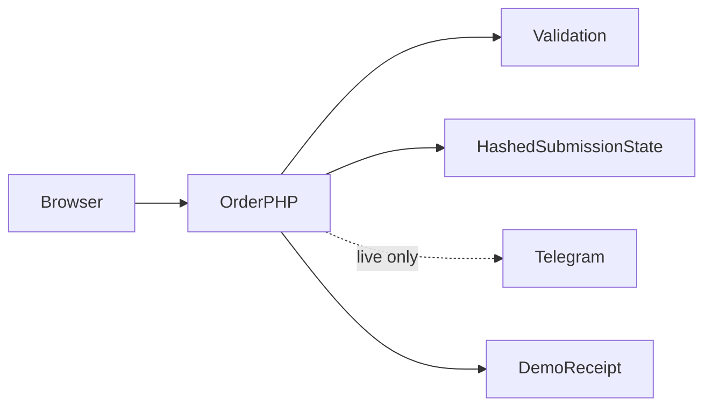

# بنية Flashdrop

اختيار النوع والتوصيل ← فحص الحقول ← إرسال PHP مع مفتاح منع التكرار ← تحقق الخادم ← قبول العرض أو تأكيد Telegram ← عرض رقم الطلب من الخادم.

## القرارات والمفاضلات

- نقل توكن البوت من المتصفح يغير حدود الثقة: يرسل المتصفح الطلب ويحتفظ الخادم ببيانات المزود.
- قوائم القيم المسموحة مأخوذة من خيارات الواجهة. يمكن تجاوز فحص المتصفح وحده.
- يمنع سجل طلب مقفل ومحمي بالتجزئة إعادة إرسال الطلب الناجح. تحتاج نتيجة المزود غير المؤكدة إلى مراجعة.
- يحفظ سجل النجاح المحلي أرقام الإيصالات والأوقات فقط. مسودة النموذج محلية ويجب حذفها على الأجهزة المشتركة.

## مراجع الشيفرة

- [index.html](../index.html)
- [api/order.php](../api/order.php)
- [api/options.json](../api/options.json)

## الحدود

تُفحص أسماء البلديات من حيث الطول وليس من قائمة إدارية شاملة. لا توجد معالجة دفع. تحتاج نتائج إرسال Telegram غير المؤكدة إلى مراجعة المشغل.
