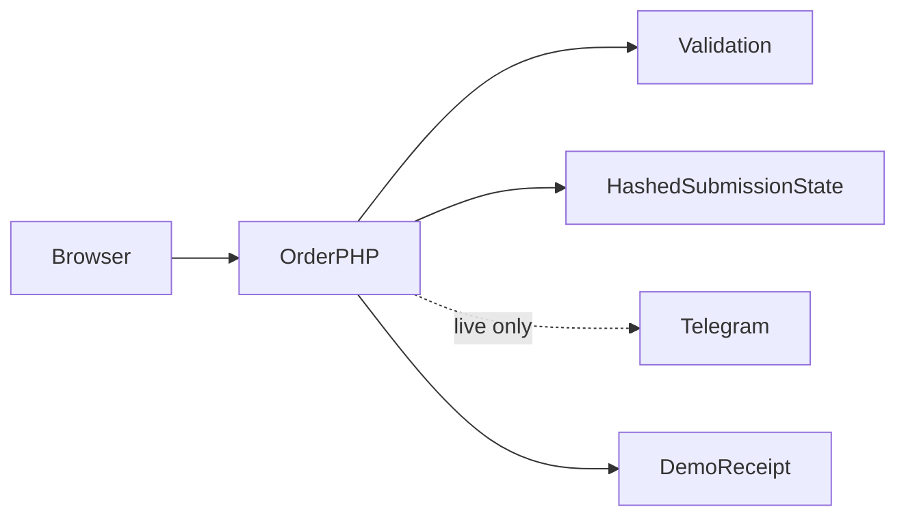

# Flashdrop architecture

Choose variant and delivery → validate customer fields → submit to PHP with an idempotency key → server validates again → demo accepts or Telegram confirms → interface displays the server order number.

## Decisions and tradeoffs

- Moving the bot token out of browser code changes the trust boundary: the browser sends an order, while the server owns provider credentials.
- Server allowlists are derived from the actual variant and delivery controls. Browser validation alone is bypassable.
- A locked hashed submission record avoids resending a successful request. An uncertain provider outcome is held for reconciliation rather than silently retried.
- Successful local backups contain only receipt IDs and timestamps. Draft form recovery remains local and should be cleared on shared devices.

## Component boundaries

| Component | Responsibility |
|---|---|
| `index.html` | Landing page and order interface |
| `api/order.php` | Validation, idempotency and provider boundary |
| `api/options.json` | Allowed existing order options |
| `1.jpg … 5.jpg` | Existing product imagery |

## Source evidence

- [index.html](../index.html)
- [api/order.php](../api/order.php)
- [api/options.json](../api/options.json)

## Limits

Municipality names are validated for length, not against a complete administrative dataset. No payment processing. Live Telegram delivery requires a separate provider check; uncertain sends require operator reconciliation.
